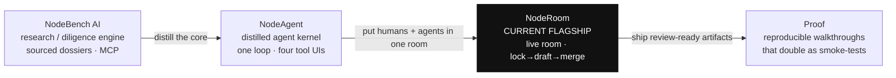

<h2 align="center">👋 Hi, I'm Homen Shum</h2>

<h3 align="center">Building <a href="https://github.com/HomenShum/noderoom">NodeRoom</a> — a live room where humans and AI agents do high-trust research together, without clobbering each other.</h3>

<em>A career, compiled: banking/finance → data engineering → agentic AI, converging on human-agent collaboration systems where the agent leaves receipts.</em>

<b>Meta</b> · agentic QA (PQX) &nbsp;·&nbsp; <b>JPMorgan</b> · 3.5 yrs, credit + agentic-RAG over 100k+ docs &nbsp;·&nbsp; <b>Ideaflow</b> &nbsp;·&nbsp; Founder, <b>NodeBench&nbsp;AI</b> &nbsp;·&nbsp; UC&nbsp;Santa&nbsp;Barbara &nbsp;·&nbsp; <a href="https://www.linkedin.com/in/homen-shum/">full&nbsp;history&nbsp;↗</a>

  
  
  

  
  
  
  
  
  
  

---

<!--
HERO — real walkthrough GIF (assets/noderoom-hero.gif): the "Live Startup Diligence War Room", encoded from docs/walkthroughs/startup-diligence-war-room.mp4 (t3–t17, 820px, 10fps).
A lighter static fallback still lives at assets/noderoom-hero.svg if you ever want it.

Original capture notes (kept for reference): ~10-15s, no audio, ≤820px, seamless loop.
Capture rig: Playwright drives a real session → Remotion frames → ffmpeg to GIF (so the hero doubles as a smoke test — record it the way you ship it).

  Beat 1 — THE ROOM IS ALIVE: open on the shared diligence sheet with TWO human cursors + at least one NodeAgent badge in the same room. A NodeAgent cell visibly fills ("Series A · $12M · led by ___") while a human types in an adjacent cell. Coexistence, not takeover.
  Beat 2 — SAFE SHARED EDITS (the money beat): trigger lock → draft → smart-merge on one row. The agent claims an affected-range lock, the human's nearby in-progress edit is NOT overwritten, the draft merges in. Hold on the "preserved your edit" / no-clobber affordance.
  Beat 3 — EVIDENCE STREAMS IN: findings stream into the sheet (a variance column fills), the note panel, and the post-it wall; a source chip snaps onto a claim. Evidence attached, not asserted.
  Beat 4 — REVIEW-READY: end on the review artifacts — company brief + runway chart + open-questions list.

  Direction: one unbroken flow, no cuts; hide chrome/devtools; cursor labels on (who is human, who is agent). If it runs long, sacrifice Beat 3, never Beat 2. Use feature-walkthrough-gif (below) to make it reproducible.
-->

  

---

### 🗺️ The system map — one lineage, not scattered repos

| Repo | Layer | What it is |
| --- | --- | --- |
| **[noderoom](https://github.com/HomenShum/noderoom)** ⭐ | **Current flagship** | Live multi-panel room where humans + NodeAgents edit a shared spreadsheet, note, and post-it wall through one versioned concurrency model — `lock → draft → smart-merge`, no-clobber, per-element CAS. |
| **[nodebench-ai](https://github.com/HomenShum/nodebench-ai)** | Research engine | Entity intelligence for any company, market, or question — searches + synthesizes with sources, turns each run into a reusable artifact, and ships a hosted public-research MCP. |
| **[NodeAgent](https://github.com/HomenShum/NodeAgent)** | Agent kernel | The distilled core of NodeBench — one loop, four tool UIs: live context, grounded/cited search, a versioned spreadsheet delta, and a TipTap notebook memo. |
| **[feature-walkthrough-gif](https://github.com/HomenShum/feature-walkthrough-gif)** | Proof / media | Playwright → Remotion → ffmpeg turns any feature into an annotated walkthrough GIF — and because it's scripted, the GIFs double as an integration smoke-test. |
| **[parity-studio](https://github.com/HomenShum/parity-studio)** | Visual QA | Image (or live app route) → verified componentized `ui_kit`, self-judged on a 16-check deterministic rubric with honest score drift before any agent touches production. |
| **[LLM-Prior-Authorization…](https://github.com/HomenShum/LLM-Prior-Authorization-Form-Auto-Fill-System-With-Eval)** | Regulated workflow | LLMs auto-fill prior-auth forms from patient notes — structured extraction, a validation pass, and an LLM-as-a-Judge eval that scores on clinical knowledge, not string match. |

Productivity infra: **[gmail-workspace-public](https://github.com/HomenShum/gmail-workspace-public)** (large inbox → one queue, one decision; private data stays local, public research delegated to NodeBench) · **[agent-workspace-template](https://github.com/HomenShum/agent-workspace-template)** (reusable Convex/Next agent-workspace runtime).

---

### 🧬 The lineage

---

### 🛠️ A career, compiled

Five capability buckets, each load-bearing in the work above:

- **Banking & diligence** — 3.5 yrs at JPMorgan: credit analysis (72 deals, ~$800M, 270 models) plus "LLMsuite," an agentic-RAG diligence tool over 100k+ documents. Turning messy research into structured, *cited* sheets and risk models — the reason NodeRoom is a War Room, not a toy.
- **Data engineering** — pipelines, schemas, reactive runtimes (Convex), durable streaming. The plumbing under every live room and report.
- **Agentic AI & evals** — agentic QA at Meta (PQX) and eval pipelines at Ideaflow: grounded search, tool loops, versioned model deltas, LLM-as-a-Judge scoring, scenario-based tests. Agents that get checked, not trusted — the harness matters more than the model.
- **Healthcare / regulated workflows** — prior-auth auto-fill with validation + eval: structured extraction where being wrong has consequences.
- **Product engineering** — Next.js / React / TS surfaces, UI parity harnesses, reproducible demos. The artifacts people actually click.

---

### 🎯 Current flagship demo — NodeRoom: Live Startup Diligence War Room

Multiple humans and multiple NodeAgents research companies **in one live room** and enrich a shared diligence sheet together:

- Agents claim an **affected-range lock** (still readable as context), a blocked agent **drafts around** it, and on unlock the draft **smart-merges** — committed human edits are never clobbered. Every edit carries a per-element version (**CAS**).
- Findings **stream** into the sheet, the note panel, and the post-it wall — no refresh; server-led agent work reaches every client (e.g. the live `Q3DEMO` room, `/ask reconcile Q3 revenue` filling a variance column).
- Runs **two modes from the same code**: a deterministic **no-key** in-memory engine + scripted agents (`npm run demo`), and **Live** with a real Convex reactive backend + a model-routed LLM agent (routes promoted by ladder evidence, not provider brand).
- Ends with **downstream-ready review artifacts**: company brief, runway chart, open-questions list.

> **People + agents + artifacts + evidence + review + shareability.**

---

<b>📚 Selected earlier work</b> — the arc that compiled into the systems above

 

| Project | Signal |
| --- | --- |
| [Banking assistant](https://github.com/HomenShum/Banking_assistant_streamlit) | Finance-document assistant for company/PDF analysis — the diligence reflex, pre-NodeBench. |
| [openai-agent-eval-framework](https://github.com/HomenShum/openai-agent-eval-framework) | Agent evaluation for classification, context verification, and pruning — the eval discipline, early. |
| [CosmaNeura med billing](https://github.com/HomenShum/CosmaNeura-Med-Billing) | ICD/CPT recommendation from physician dictation — regulated extraction before the prior-auth system. |
| [FluencyMed](https://github.com/HomenShum/FluencyMed-Pub) | Early healthcare AI workflow prototype. |
| [voice_email_agent](https://github.com/HomenShum/voice_email_agent) | Email ingestion, summarization, embeddings, voice query — the seed of the Gmail workspace. |

---

### 💡 What I care about

**The agent should leave receipts.** Sources on every claim, a version on every edit, an eval on every answer, and a demo anyone can reproduce. High-trust work doesn't get faster by trusting the model more — it gets faster by making the model *checkable*.

📫 [LinkedIn](https://www.linkedin.com/in/homen-shum/) · `hshum2018@gmail.com`
