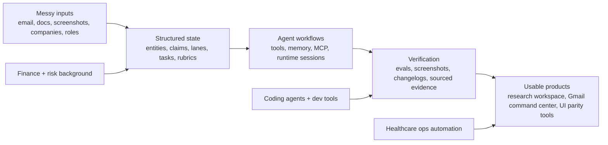

# Homen Shum

I build agentic workflow infrastructure: local-first workspaces, public research tools, UI verification harnesses, and automation systems that turn messy inputs into usable decisions.

## What I Build

My strongest work sits at the intersection of applied AI, workflow software, and real operating pain:

- agent workspaces that combine chat, tools, memory, files, and structured state
- public research pipelines for companies, people, roles, claims, and sourced dossiers
- private-context automation for email, documents, career workflows, healthcare ops, and finance research
- UI parity and dogfood systems that make agent-generated work easier to verify
- reusable templates and submission protocols that help humans and coding agents collaborate

## Flagship Projects

| Project | What it proves | Stack / surface |
|---|---|---|
| [nodebench-ai](https://github.com/HomenShum/nodebench-ai) | Entity intelligence workspace for chat-first research, living reports, Convex runtime state, MCP tools, public research, and sourced context packs. | TypeScript, Next.js, Convex, MCP, research pipelines |
| [parity-studio](https://github.com/HomenShum/parity-studio) | Screenshot/design to verified componentized UI, with boolean parity rubrics and an MCP-ready local dashboard. | TypeScript, UI decomposition, Playwright-style verification |
| [gmail-workspace-public](https://github.com/HomenShum/gmail-workspace-public) | Public-safe version of a local-first Gmail command center for inbox lanes, job triage, pinned context, and private agent workflows. | TypeScript, Next.js, local-first workflow design |
| [easier-to-read-submissions](https://github.com/HomenShum/easier-to-read-submissions) | Drop-in protocol for clearer agent/dev handoffs: per-surface changelog lanes, verified demo artifacts, and ASCII runtime diagrams. | JavaScript, Playwright, changelog systems, agent workflow hygiene |
| [agent-workspace-template](https://github.com/HomenShum/agent-workspace-template) | Reusable Convex + Next.js workspace template for agent products, extracted from a production-style workflow app. | TypeScript, Next.js, Convex, Vercel |
| [LLM prior auth eval system](https://github.com/HomenShum/LLM-Prior-Authorization-Form-Auto-Fill-System-With-Eval) | Healthcare automation with structured extraction, validation, and evaluation around prior authorization workflows. | Python, FastAPI, Streamlit, structured outputs |

## Portfolio Map

## Current Focus

| Area | Direction |
|---|---|
| Agent infrastructure | MCP tool profiles, agent memory, public/private data boundaries, cost-aware research runs |
| Personal workflow software | Gmail/job triage, pinned context, daily sweeps, career pipeline automation |
| UI verification | Screenshot-to-component decomposition, parity rubrics, browser dogfooding, demo artifacts |
| Research systems | Public dossiers, claim verification, company/person/role context packs |
| Applied domains | Finance research, healthcare operations, hiring workflows, document automation |

## Why This Work Exists

I started from finance, risk, and operations work where the hard part was rarely a single model call. The hard part was turning fragmented information into a decision someone could trust.

That shaped the systems I build now:

- source-backed research instead of unsourced summaries
- private data kept local while public research can be reused
- explicit confidence, evidence, and review queues
- interfaces that help people decide what to do next
- engineering handoffs that show what changed, where, and why

## Selected Earlier Work

| Project | Signal |
|---|---|
| [Banking assistant](https://github.com/HomenShum/Banking_assistant_streamlit) | Early finance document assistant for company/PDF analysis. |
| [FluencyMed-Pub](https://github.com/HomenShum/FluencyMed-Pub) | Early healthcare AI workflow prototype. |
| [CosmaNeura medical billing](https://github.com/HomenShum/CosmaNeura-Med-Billing) | ICD/CPT recommendation workflow from physician dictation. |
| [openai-agent-eval-framework](https://github.com/HomenShum/openai-agent-eval-framework) | Agent evaluation concepts for classification, context verification, and pruning. |
| [voice_email_agent](https://github.com/HomenShum/voice_email_agent) | Email ingestion, summarization, embeddings, and voice-assistant query pipeline. |

## How To Read This GitHub

Start with [nodebench-ai](https://github.com/HomenShum/nodebench-ai) for the deepest infrastructure work.

Open [gmail-workspace-public](https://github.com/HomenShum/gmail-workspace-public) if you want the personal workflow/product angle.

Open [parity-studio](https://github.com/HomenShum/parity-studio) if you want UI automation, parity, and verification.

Open [easier-to-read-submissions](https://github.com/HomenShum/easier-to-read-submissions) if you want to see how I package work so another human or coding agent can inspect it quickly.

